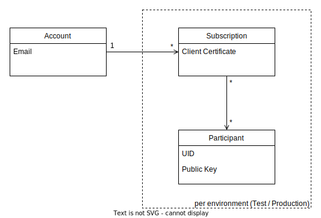

The following diagram gives a simplified overview of how accounts, subscriptions and participants relate:

# Account
An account is needed to partake in EASX. An account can create, access and manage subscriptions.

Sign up on the [EASX portal](https://portal.easx.ch) to create an account.

# Subscription
A subscription allows access to the EASX system. It can be created per environment granting
access to the [APIs](APIs.md) provided for this environment.

Subscriptions can be mapped to multiple participants (UIDs). For this it must be explicitly 
registered providing information on the connected UIDs.
After registering a subscription (see [Getting Started](Getting-Started.md)), a *client certificate* is provided which
is required to make requests for this subscription on the EASX APIs.

# Participant
A legal entity (usually pension fund) that can receive and send documents. It is identified by the
standardised business identification number (UID - Unternehmens-Identifikationsnummer).

Multiple subscriptions can be mapped to a participant. This allows multiple systems to handle documents and other functionalities of a participant.

Every participant has a *public key* that is used to encrypt documents sent to this participant and verify signatures for documents received from this participant. The mtaching *private key* is only available to the participant and is used by the participant to decrypt received documents and sign sent documents.